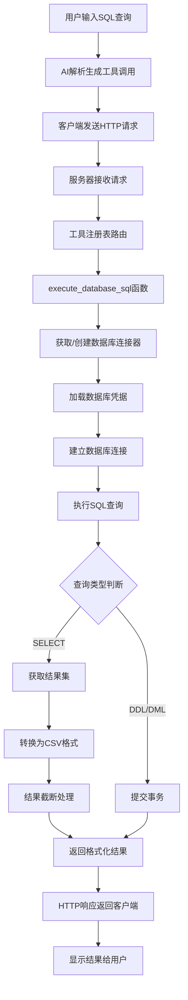
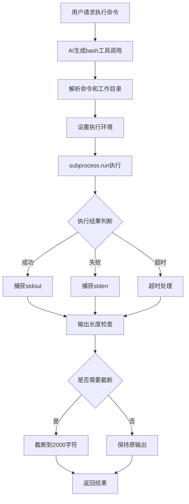
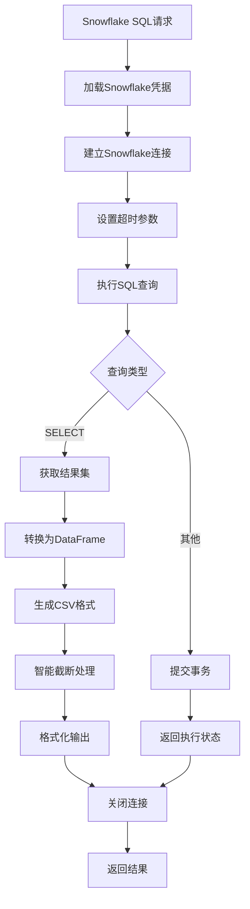
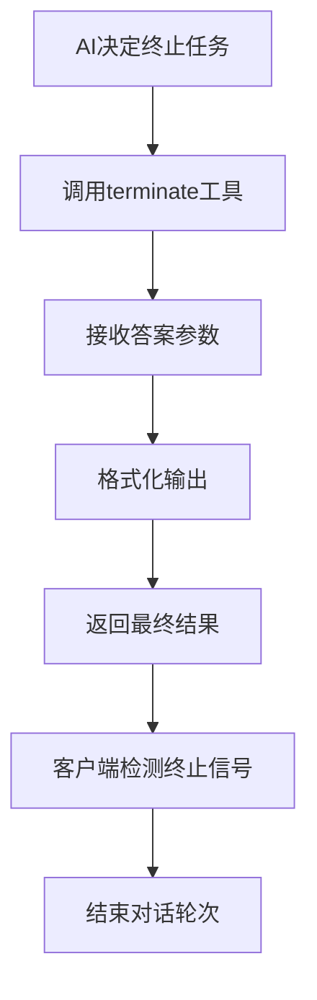

# 🤖 Spider agent 

从Spider2中抽象出来，Spider agent

## 快速启动
1. /credentials 目录下配置数据库

2. 环境配置
复制 `.env.example` 为 `.env`  填入您的 API 密钥和配置信息

3. 启动工具服务器
``` bash
./run_server.sh
```

4. 启动客户端Agent
``` bash
./run_chat.sh
```

模型model name 在run_chat.sh中修改


## 🏗️ 系统架构概览

这个智能体系统采用**客户端-服务器分离架构**，包含以下核心组件：

```
┌─────────────────┐    HTTP API    ┌─────────────────┐
│   客户端 Agent   │ ──────────────► │   工具服务器     │
│   (llm_agent)   │                │   (serve.py)    │
└─────────────────┘                └─────────────────┘
        │                                   │
        ▼                                   ▼
┌─────────────────┐                ┌─────────────────┐
│ 消息处理器       │                │ 工具注册表       │
│(message_processor)│               │(tool_registry)  │
└─────────────────┘                └─────────────────┘
                                           │
                                           ▼
                                   ┌─────────────────┐
                                   │   具体工具实现   │
                                   │ • database_tool │
                                   │ • bash_tool     │
                                   │ • snowflake_tool│
                                   │ • terminator_tool│
                                   └─────────────────┘
```

## 🔧 配置的工具列表

根据 `universal_agent.txt` 配置，系统包含以下工具：

1. **execute_database_sql** - 数据库查询工具
2. **execute_bash** - Bash命令执行工具  
3. **terminate** - 任务终止工具
4. **execute_snowflake_sql** - Snowflake专用数据库工具

---

## 🛠️ 各工具详细工作流程

### 1. 📊 execute_database_sql 工具

**功能**: 执行SQL查询，支持多种数据库类型

#### 🔄 完整工作流程：



#### 📋 详细步骤：

**1. 初始化阶段**
```python
def execute_database_sql(sql: str, db_type: str = "mysql", **kwargs):
    logger.info(f"Executing {db_type.upper()} SQL: {sql}")
    timeout = kwargs.get('timeout', TIMEOUT)  # 默认60秒
```

**2. 连接器管理**
```python
def get_database_connector(db_type: str = "mysql") -> DatabaseConnector:
    global _db_connector
    if _db_connector is None or _db_connector.db_type != db_type:
        _db_connector = DatabaseConnector(db_type)
    return _db_connector
```
- 使用全局单例模式管理连接器
- 支持连接复用，提高性能
- 支持动态切换数据库类型

**3. 凭据加载**
```python
def get_credentials(self) -> Dict[str, Any]:
    credentials_path = f"credentials/{self.db_type}_credential.json"
    # 加载凭据文件或使用默认配置
```
- 支持的凭据文件：
  - `mysql_credential.json`
  - `postgresql_credential.json` 
  - `sqlite_credential.json`
  - `snowflake_credential.json`

**4. 多数据库连接支持**
```python
if self.db_type == "mysql" and MYSQL_AVAILABLE:
    self.connection = mysql.connector.connect(**credentials)
elif self.db_type == "postgresql" and POSTGRESQL_AVAILABLE:
    self.connection = psycopg2.connect(**credentials)
elif self.db_type == "sqlite" and SQLITE_AVAILABLE:
    self.connection = sqlite3.connect(credentials["database"])
elif self.db_type == "snowflake" and SNOWFLAKE_AVAILABLE:
    self.connection = snowflake.connector.connect(**credentials)
```

**5. 智能结果处理**
```python
# SELECT查询结果处理
if cursor.description:
    headers = [desc[0] for desc in cursor.description]
    rows = cursor.fetchall()
    df = pd.DataFrame(rows, columns=headers)
    full_csv_data = df.to_csv(index=False)
    
    # 智能截断（2000字符限制）
    if len(full_csv_data) > MAX_CSV_CHARS:
        truncated_csv = full_csv_data[:MAX_CSV_CHARS]
        last_newline = truncated_csv.rfind('\n')
        if last_newline > 0:
            truncated_csv = truncated_csv[:last_newline]
```

**6. 工具别名注册**
```python
def register_tools(registry):
    registry.register_tool("execute_database_sql", execute_database_sql)
    # 向后兼容的特定数据库工具
    registry.register_tool("execute_mysql_sql", lambda sql, **kwargs: execute_database_sql(sql, "mysql", **kwargs))
    registry.register_tool("execute_postgresql_sql", lambda sql, **kwargs: execute_database_sql(sql, "postgresql", **kwargs))
    registry.register_tool("execute_sqlite_sql", lambda sql, **kwargs: execute_database_sql(sql, "sqlite", **kwargs))
```

---

### 2. 💻 execute_bash 工具

**功能**: 执行系统Bash命令

#### 🔄 工作流程：



#### 📋 详细实现：

**1. 命令执行核心**
```python
def execute_bash(command: str, work_dir: str = None, **kwargs) -> Dict[str, Any]:
    logger.info(f"Executing bash command: {command}")
    logger.info(f"Working directory: {work_dir}")
    
    cwd = work_dir if work_dir else os.getcwd()
    
    proc = subprocess.run(
        command,
        shell=True,
        cwd=cwd,
        capture_output=True,
        text=True,
        timeout=kwargs.get('timeout', TIMEOUT)  # 默认30秒
    )
```

**2. 结果处理逻辑**
```python
stdout = proc.stdout
stderr = proc.stderr
return_code = proc.returncode
success = return_code == 0

if success:
    content = stdout
else:
    content = f"Error: {stderr}" if stderr else "Command execution failed"

# 输出截断处理
if len(content) > MAX_CHARS:
    truncated_content = content[:MAX_CHARS]
    total_chars = len(content)
    content = f"{truncated_content}\n\n[OUTPUT TRUNCATED]\nThe output has been truncated due to length ({total_chars} characters total, showing first {MAX_CHARS} characters)."
```

**3. 异常处理**
```python
except subprocess.TimeoutExpired:
    content = f"Command timed out after {kwargs.get('timeout', TIMEOUT)} seconds"
    success = False
except Exception as e:
    content = f"Error executing command: {str(e)}"
    success = False
```

---

### 3. ❄️ execute_snowflake_sql 工具

**功能**: 专门用于Snowflake数据库的SQL执行

#### 🔄 工作流程：



#### 📋 关键特性：

**1. 专用凭据管理**
```python
def get_snowflake_credentials() -> Dict[str, str]:
    credentials_path = "credentials/snowflake_credential.json"
    try:
        with open(credentials_path, "r") as f:
            return json.load(f)
    except FileNotFoundError:
        logger.error(f"Credentials file not found at: {os.path.abspath(credentials_path)}")
        raise
```

**2. 连接配置**
```python
conn = snowflake.connector.connect(
    **snowflake_credential,
    login_timeout=timeout,
    network_timeout=timeout
)
```

**3. 结果处理**
```python
if cursor.description:
    headers = [desc[0] for desc in cursor.description]
    rows = cursor.fetchall()
    df = pd.DataFrame(rows, columns=headers)
    
    full_csv_data = df.to_csv(index=False)
    total_rows = len(df)
    
    # 智能截断逻辑
    if len(full_csv_data) > MAX_CSV_CHARS:
        truncated_csv = full_csv_data[:MAX_CSV_CHARS]
        last_newline = truncated_csv.rfind('\n')
        if last_newline > 0:
            truncated_csv = truncated_csv[:last_newline]
```

---

### 4. 🏁 terminate 工具

**功能**: 结束任务并提供最终答案

#### 🔄 工作流程：



#### 📋 简单实现：

```python
def terminate(answer: str, task_completed: str = "false", **kwargs) -> Dict[str, Any]:
    output = f"EXECUTION RESULT of [terminate]:\n{answer}"
    return {
        "content": output
    }

def register_tools(registry):
    registry.register_tool("terminate", terminate)
    registry.register_tool("finish", terminate)  # 别名支持
```

---

## 🔄 系统级工作流程

### 1. 🚀 服务器启动流程

```python
# serve.py
app = FastAPI(title="Tools Server API")
tool_registry = ToolRegistry()
tool_registry.load_tools()  # 自动加载所有工具

@app.post("/execute")
async def execute_tool(request: Request) -> JSONResponse:
    # 处理工具调用请求
```

**工具加载机制**：
```python
def load_tools(self):
    import servers.tools as tools_package
    
    for _, module_name, is_pkg in pkgutil.iter_modules(tools_package.__path__, tools_package.__name__ + '.'):
        if not is_pkg:
            module = importlib.import_module(module_name)
            if hasattr(module, 'register_tools'):
                module.register_tools(self)  # 注册工具
```

### 2. 🔄 客户端工具调用流程

```python
# message_processor.py
def execute_tool_calls(self, tool_calls):
    # 显示工具调用信息
    for tool_call in tool_calls:
        debug_print(True, f"正在调用工具: {tool_call['name']} 输入参数: {tool_call['arguments']} ...")
    
    # 发送HTTP请求
    url = f"http://{self.args.api_host}:{self.args.api_port}/execute"
    request_body = {"tool_calls": tool_calls}
    
    response = requests.post(url, json=request_body, timeout=30)
    
    # 处理响应结果
    for result in results:
        result_content = result.get("content", str(result))
        display_result = result_content[:50] + "..." if len(result_content) > 50 else result_content
        debug_print(True, f"工具调用结果: {display_result}")
```

### 3. 🎯 工具调用解析流程

```python
def parse_tool_calls(self, content, item):
    # 支持两种格式：
    # 1. XML格式: <function=name><parameter=key>value</parameter></function>
    # 2. JSON格式: {"function": "name", "parameters": {...}}
    
    # 自动添加工作目录
    if function_name == "execute_bash" and "work_dir" not in arguments:
        arguments["work_dir"] = os.path.join(self.args.databases_path, item['db_id'])
```

---

## 🛡️ 安全特性

### 1. **超时保护**
- 数据库查询：60秒超时
- Bash命令：30秒超时
- HTTP请求：30秒超时

### 2. **输出限制**
- CSV结果：2000字符截断
- Bash输出：2000字符截断
- 智能边界截断，避免数据破损

### 3. **错误处理**
- 全面的异常捕获
- 详细的错误日志
- 优雅的错误恢复

### 4. **资源管理**
- 数据库连接复用
- 自动连接关闭
- 线程池管理（每工具8个worker）

---

## 🚀 性能优化

### 1. **连接池管理**
```python
# 全局连接器单例
_db_connector = None

def get_database_connector(db_type: str = "mysql") -> DatabaseConnector:
    global _db_connector
    if _db_connector is None or _db_connector.db_type != db_type:
        _db_connector = DatabaseConnector(db_type)
    return _db_connector
```

### 2. **异步执行**
```python
# 工具注册表使用线程池
self.executor = concurrent.futures.ThreadPoolExecutor(max_workers=self.workers_per_tool)

async def execute_tool(self, name: str, **kwargs) -> Any:
    loop = asyncio.get_event_loop()
    result = await loop.run_in_executor(
        self.executor,
        partial(tool_func, **kwargs)
    )
    return result
```

### 3. **智能截断算法**
```python
# 在完整行边界截断，避免数据破损
if len(full_csv_data) > MAX_CSV_CHARS:
    truncated_csv = full_csv_data[:MAX_CSV_CHARS]
    last_newline = truncated_csv.rfind('\n')
    if last_newline > 0:
        truncated_csv = truncated_csv[:last_newline]
