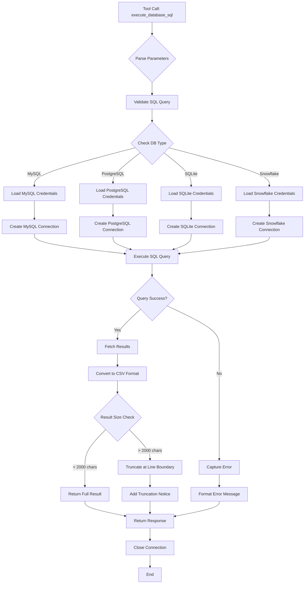
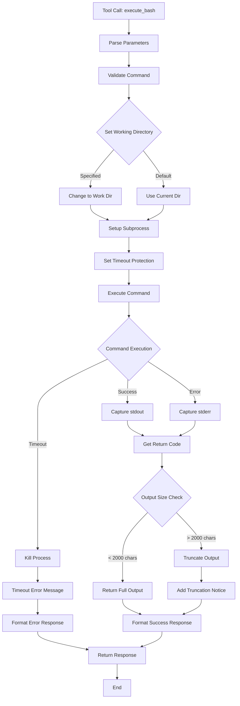
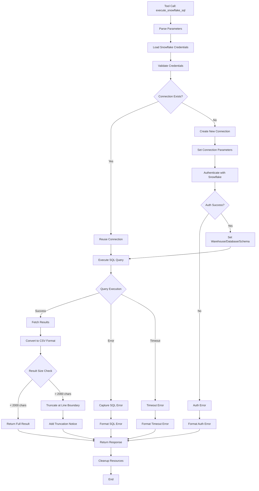
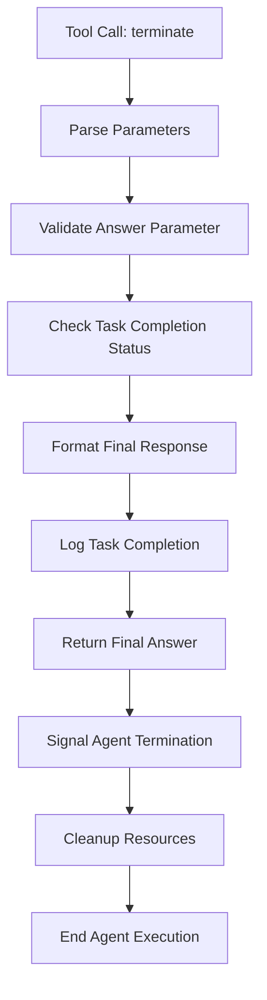
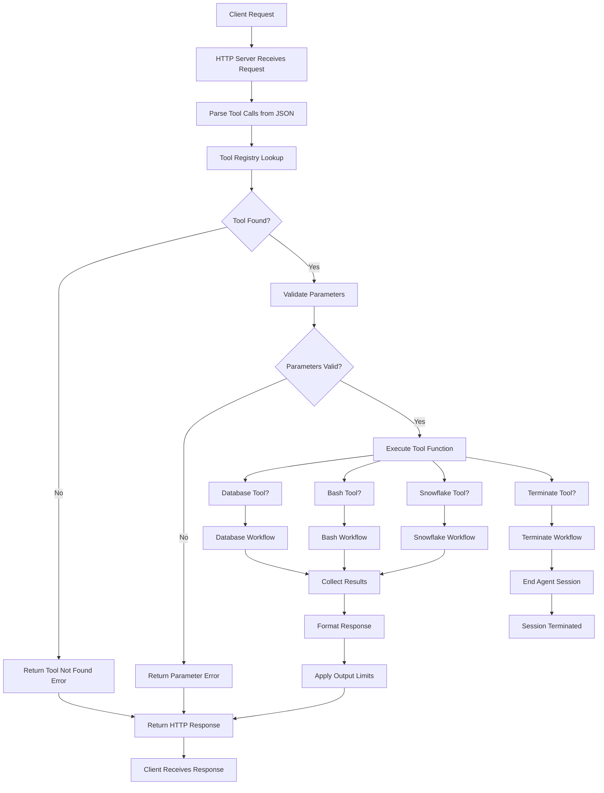

# 🛠️ Tools Documentation

This document provides detailed information about all available tools in the Spider Agent Universal system.

## Overview

The Spider Agent Universal system includes four core tools that enable comprehensive database operations and system interactions:

1. **execute_database_sql** - Multi-database SQL execution
2. **execute_bash** - System command execution  
3. **execute_snowflake_sql** - Snowflake-specific operations
4. **terminate** - Task completion and result finalization

---

## 📊 Database SQL Tool (execute_database_sql)

### Description
A versatile database tool that supports multiple database types with intelligent connection management and result processing.

### Workflow Diagram



### Supported Databases
- **MySQL** - Full support with mysql-connector-python
- **PostgreSQL** - Full support with psycopg2
- **SQLite** - Built-in support with sqlite3
- **Snowflake** - Enterprise support with snowflake-connector-python

### Parameters

| Parameter | Type | Required | Default | Description |
|-----------|------|----------|---------|-------------|
| `sql` | string | ✅ | - | The SQL query to execute |
| `db_type` | string | ❌ | "mysql" | Database type (mysql/postgresql/sqlite/snowflake) |
| `timeout` | integer | ❌ | 60 | Query timeout in seconds |

### Usage Examples

#### Basic SELECT Query
```json
{
  "function": "execute_database_sql",
  "parameters": {
    "sql": "SELECT * FROM users LIMIT 10",
    "db_type": "mysql"
  }
}
```

#### PostgreSQL Query
```json
{
  "function": "execute_database_sql",
  "parameters": {
    "sql": "SELECT COUNT(*) FROM orders WHERE created_at > '2024-01-01'",
    "db_type": "postgresql"
  }
}
```

#### SQLite Query
```json
{
  "function": "execute_database_sql",
  "parameters": {
    "sql": "CREATE TABLE test (id INTEGER PRIMARY KEY, name TEXT)",
    "db_type": "sqlite"
  }
}
```

### Configuration

#### Credential Files
Create JSON files in the `credentials/` directory:

**MySQL** (`credentials/mysql_credential.json`):
```json
{
  "host": "localhost",
  "port": 3306,
  "user": "username",
  "password": "password",
  "database": "database_name"
}
```

**PostgreSQL** (`credentials/postgresql_credential.json`):
```json
{
  "host": "localhost",
  "port": 5432,
  "user": "postgres",
  "password": "password",
  "database": "database_name"
}
```

**SQLite** (`credentials/sqlite_credential.json`):
```json
{
  "database": "/path/to/database.db"
}
```

### Features

#### 🔄 Connection Management
- **Singleton Pattern**: Reuses connections for better performance
- **Auto-reconnection**: Handles connection drops gracefully
- **Type Switching**: Dynamically switches between database types

#### 📊 Result Processing
- **CSV Output**: Results formatted as CSV for easy reading
- **Smart Truncation**: Limits output to 2000 characters at line boundaries
- **Row Counting**: Shows total rows even when truncated
- **Error Handling**: Comprehensive error messages

#### ⏱️ Performance
- **Connection Pooling**: Reuses database connections
- **Timeout Protection**: 60-second default timeout
- **Memory Efficient**: Streams large result sets

### Return Format

#### Successful Query
```json
{
  "content": "EXECUTION RESULT of [execute_database_sql]:\nQuery executed successfully\n\n```csv\nid,name,email\n1,John Doe,john@example.com\n2,Jane Smith,jane@example.com\n```"
}
```

#### Truncated Results
```json
{
  "content": "EXECUTION RESULT of [execute_database_sql]:\nQuery executed successfully\n\n```csv\nid,name,email\n1,John Doe,john@example.com\n...\n```\n\nNote: Result truncated to 2000 characters. Complete result has 1000 rows and 50000 characters."
}
```

#### Error Response
```json
{
  "content": "EXECUTION RESULT of [execute_database_sql]:\nDatabase Error: Table 'users' doesn't exist"
}
```

---

## 💻 Bash Command Tool (execute_bash)

### Description
Executes system commands safely with timeout protection and output management.

### Workflow Diagram



### Parameters

| Parameter | Type | Required | Default | Description |
|-----------|------|----------|---------|-------------|
| `command` | string | ✅ | - | The bash command to execute |
| `work_dir` | string | ❌ | current dir | Working directory for command execution |
| `timeout` | integer | ❌ | 30 | Command timeout in seconds |

### Usage Examples

#### File Operations
```json
{
  "function": "execute_bash",
  "parameters": {
    "command": "ls -la",
    "work_dir": "/home/user/project"
  }
}
```

#### System Information
```json
{
  "function": "execute_bash",
  "parameters": {
    "command": "df -h && free -m"
  }
}
```

#### Package Management
```json
{
  "function": "execute_bash",
  "parameters": {
    "command": "pip install pandas",
    "timeout": 120
  }
}
```

### Features

#### 🛡️ Security
- **Timeout Protection**: 30-second default timeout
- **Working Directory**: Isolated execution environment
- **Error Capture**: Captures both stdout and stderr

#### 📝 Output Management
- **Smart Truncation**: Limits output to 2000 characters
- **Full Logging**: Complete command and result logging
- **Return Code**: Tracks command success/failure

### Return Format

#### Successful Command
```json
{
  "content": "EXECUTION RESULT of [execute_bash]:\ntotal 48\ndrwxr-xr-x 12 user user 4096 Jan 15 10:30 .\ndrwxr-xr-x  3 user user 4096 Jan 15 10:25 ..\n-rw-r--r--  1 user user  220 Jan 15 10:25 .bashrc"
}
```

#### Command Error
```json
{
  "content": "EXECUTION RESULT of [execute_bash]:\nError: ls: cannot access '/nonexistent': No such file or directory"
}
```

#### Timeout Error
```json
{
  "content": "EXECUTION RESULT of [execute_bash]:\nCommand timed out after 30 seconds"
}
```

---

## ❄️ Snowflake SQL Tool (execute_snowflake_sql)

### Description
Specialized tool for Snowflake database operations with optimized connection handling.

### Workflow Diagram



### Parameters

| Parameter | Type | Required | Default | Description |
|-----------|------|----------|---------|-------------|
| `sql` | string | ✅ | - | The SQL query to execute |
| `timeout` | integer | ❌ | 60 | Query timeout in seconds |

### Configuration

**Snowflake Credentials** (`credentials/snowflake_credential.json`):
```json
{
  "account": "your-account.snowflakecomputing.com",
  "user": "username",
  "password": "password",
  "warehouse": "COMPUTE_WH",
  "database": "DATABASE_NAME",
  "schema": "SCHEMA_NAME",
  "role": "ROLE_NAME"
}
```

### Usage Examples

#### Data Warehouse Query
```json
{
  "function": "execute_snowflake_sql",
  "parameters": {
    "sql": "SELECT * FROM SALES_DATA WHERE DATE >= '2024-01-01' LIMIT 100"
  }
}
```

#### Analytics Query
```json
{
  "function": "execute_snowflake_sql",
  "parameters": {
    "sql": "SELECT REGION, SUM(REVENUE) FROM SALES GROUP BY REGION ORDER BY SUM(REVENUE) DESC"
  }
}
```

### Features

#### 🏢 Enterprise Features
- **Dedicated Connection**: Optimized for Snowflake
- **Warehouse Management**: Automatic warehouse handling
- **Role-based Access**: Supports Snowflake role system

#### ⚡ Performance
- **Connection Timeout**: Configurable login and network timeouts
- **Result Streaming**: Efficient handling of large datasets
- **Auto-commit**: Automatic transaction management

---

## 🏁 Termination Tool (terminate)

### Description
Signals task completion and provides final results to the user.

### Workflow Diagram



### Parameters

| Parameter | Type | Required | Default | Description |
|-----------|------|----------|---------|-------------|
| `answer` | string | ✅ | - | The final answer or result |
| `task_completed` | string | ❌ | "false" | Task completion status |

### Usage Examples

#### Task Completion
```json
{
  "function": "terminate",
  "parameters": {
    "answer": "Analysis complete. Found 1,234 records matching the criteria. The average revenue per customer is $456.78.",
    "task_completed": "true"
  }
}
```

#### Alternative Alias
```json
{
  "function": "finish",
  "parameters": {
    "answer": "Database schema analysis completed successfully."
  }
}
```

### Features

#### 🎯 Task Management
- **Clean Termination**: Properly ends agent execution
- **Result Delivery**: Provides final answer to user
- **Alias Support**: Available as both `terminate` and `finish`

### Return Format

```json
{
  "content": "EXECUTION RESULT of [terminate]:\nAnalysis complete. Found 1,234 records matching the criteria. The average revenue per customer is $456.78."
}
```

---

## 🔄 System-Level Workflow

### Overall Tool Execution Flow



### Tool Registration Process

```mermaid
graph TD
    A[Server Startup] --> B[Initialize Tool Registry]
    B --> C[Scan Tools Directory]
    C --> D[Import Tool Modules]
    D --> E[Call register_tools() for Each Module]
    
    E --> F[Database Tool Registration]
    E --> G[Bash Tool Registration]
    E --> H[Snowflake Tool Registration]
    E --> I[Terminator Tool Registration]
    
    F --> J[Register execute_database_sql]
    F --> K[Register execute_mysql_sql alias]
    F --> L[Register execute_postgresql_sql alias]
    F --> M[Register execute_sqlite_sql alias]
    
    G --> N[Register execute_bash]
    H --> O[Register execute_snowflake_sql]
    I --> P[Register terminate]
    I --> Q[Register finish alias]
    
    J --> R[Tool Registry Complete]
    K --> R
    L --> R
    M --> R
    N --> R
    O --> R
    P --> R
    Q --> R
    
    R --> S[Server Ready to Accept Requests]
```

---

## 🔧 Tool Registry System

### Auto-discovery
Tools are automatically discovered and registered through the `register_tools()` function in each tool module.

### Registration Process
```python
def register_tools(registry):
    registry.register_tool("execute_database_sql", execute_database_sql)
    registry.register_tool("execute_mysql_sql", lambda sql, **kwargs: execute_database_sql(sql, "mysql", **kwargs))
    registry.register_tool("execute_postgresql_sql", lambda sql, **kwargs: execute_database_sql(sql, "postgresql", **kwargs))
    registry.register_tool("execute_sqlite_sql", lambda sql, **kwargs: execute_database_sql(sql, "sqlite", **kwargs))
```

### Tool Aliases
Many tools support aliases for backward compatibility:
- `execute_mysql_sql` → `execute_database_sql` with `db_type="mysql"`
- `execute_postgresql_sql` → `execute_database_sql` with `db_type="postgresql"`
- `execute_sqlite_sql` → `execute_database_sql` with `db_type="sqlite"`
- `finish` → `terminate`

---

## 🛡️ Security & Safety

### Timeout Protection
All tools implement timeout mechanisms to prevent hanging operations:
- Database queries: 60 seconds
- Bash commands: 30 seconds
- Snowflake queries: 60 seconds

### Output Limitations
- Maximum output: 2000 characters per tool call
- Smart truncation at line boundaries
- Prevents memory exhaustion

### Error Handling
- Comprehensive exception catching
- Detailed error logging
- Graceful degradation

### Resource Management
- Automatic connection cleanup
- Memory-efficient result processing
- Thread pool management

---

## 📈 Performance Considerations

### Connection Pooling
- Database connections are reused when possible
- Singleton pattern for connection management
- Automatic cleanup on type changes

### Memory Management
- Streaming result processing
- Intelligent truncation algorithms
- Garbage collection friendly

### Concurrency
- Thread-safe tool execution
- Async-compatible design
- Non-blocking HTTP responses

---

## 🔍 Troubleshooting

### Common Issues

#### Database Connection Errors
1. Check credential files exist and are valid JSON
2. Verify database server is running and accessible
3. Confirm network connectivity and firewall settings

#### Command Execution Failures
1. Verify command syntax is correct
2. Check working directory exists and is accessible
3. Ensure sufficient permissions for command execution

#### Timeout Issues
1. Increase timeout values for long-running operations
2. Optimize queries for better performance
3. Check system resource availability

### Debug Logging
Enable debug logging to troubleshoot issues:
```python
import logging
logging.basicConfig(level=logging.DEBUG)
```

### Health Checks
Test tool availability:
```bash
curl -X POST http://localhost:8000/execute \
  -H "Content-Type: application/json" \
  -d '{"tool_calls": [{"name": "execute_bash", "arguments": {"command": "echo test"}}]}'
```