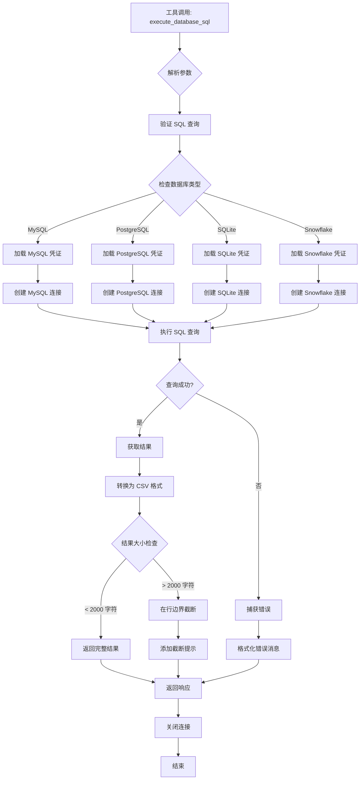
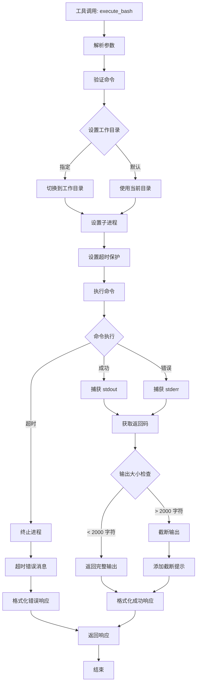
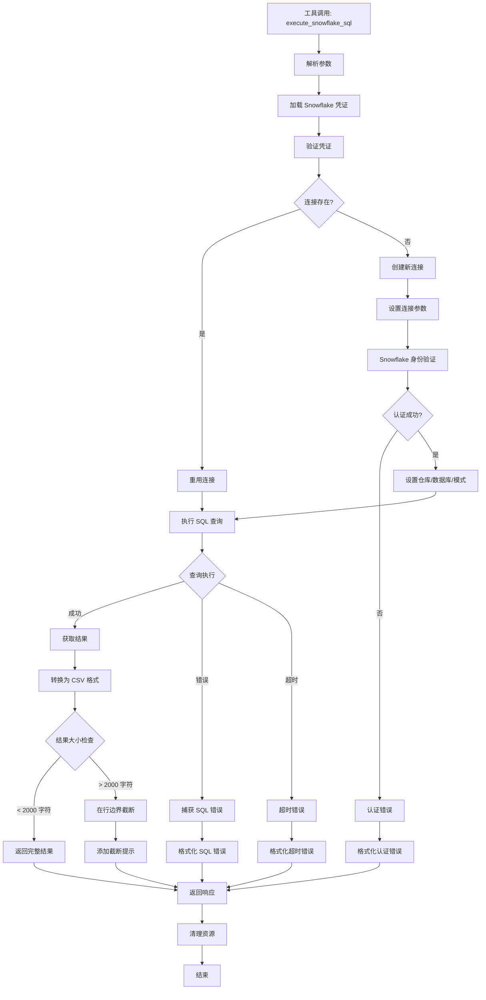
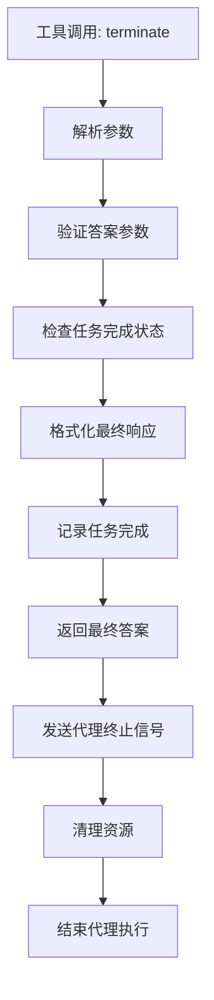
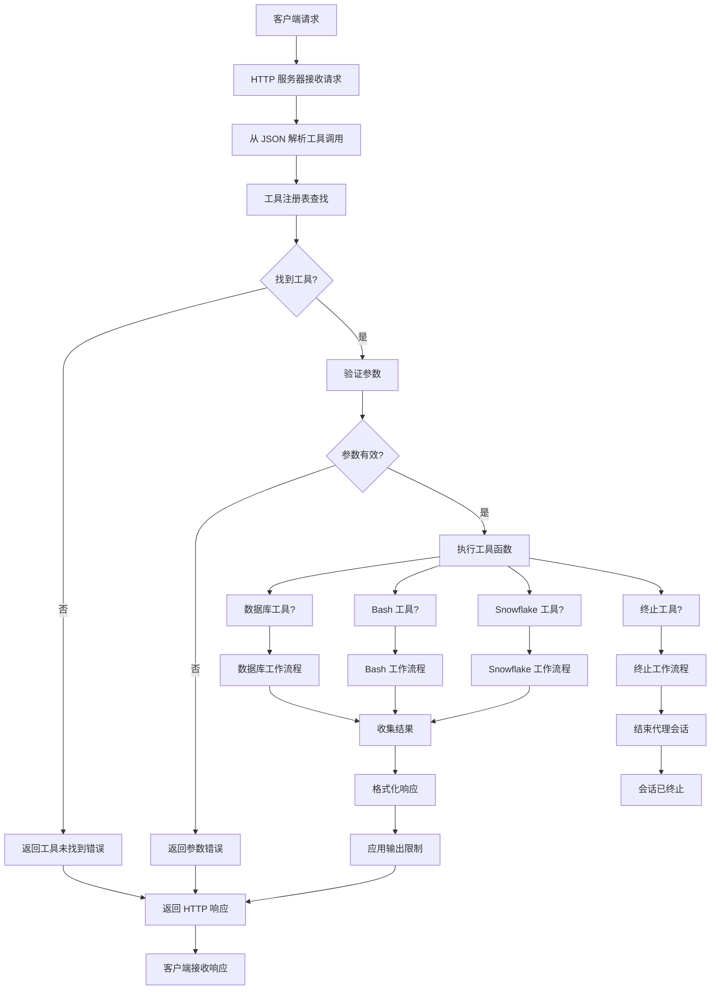

# 🛠️ 工具文档

本文档提供了 Spider Agent Universal 系统中所有可用工具的详细信息。

## 概述

Spider Agent Universal 系统包含四个核心工具，支持全面的数据库操作和系统交互：

1. **execute_database_sql** - 多数据库 SQL 执行
2. **execute_bash** - 系统命令执行
3. **execute_snowflake_sql** - Snowflake 专用操作
4. **terminate** - 任务完成和结果终结

---

## 📊 数据库 SQL 工具 (execute_database_sql)

### 描述
一个支持多种数据库类型的通用数据库工具，具有智能连接管理和结果处理功能。

### 工作流程图



### 支持的数据库
- **MySQL** - 使用 mysql-connector-python 完全支持
- **PostgreSQL** - 使用 psycopg2 完全支持
- **SQLite** - 使用 sqlite3 内置支持
- **Snowflake** - 使用 snowflake-connector-python 企业级支持

### 参数

| 参数 | 类型 | 必需 | 默认值 | 描述 |
|------|------|------|--------|------|
| `sql` | string | ✅ | - | 要执行的 SQL 查询 |
| `db_type` | string | ❌ | "mysql" | 数据库类型 (mysql/postgresql/sqlite/snowflake) |
| `timeout` | integer | ❌ | 60 | 查询超时时间（秒） |

### 使用示例

#### 基本 SELECT 查询
```json
{
  "function": "execute_database_sql",
  "parameters": {
    "sql": "SELECT * FROM users LIMIT 10",
    "db_type": "mysql"
  }
}
```

#### PostgreSQL 查询
```json
{
  "function": "execute_database_sql",
  "parameters": {
    "sql": "SELECT COUNT(*) FROM orders WHERE created_at > '2024-01-01'",
    "db_type": "postgresql"
  }
}
```

#### SQLite 查询
```json
{
  "function": "execute_database_sql",
  "parameters": {
    "sql": "CREATE TABLE test (id INTEGER PRIMARY KEY, name TEXT)",
    "db_type": "sqlite"
  }
}
```

### 配置

#### 凭证文件
在 `credentials/` 目录中创建 JSON 文件：

**MySQL** (`credentials/mysql_credential.json`):
```json
{
  "host": "localhost",
  "port": 3306,
  "user": "username",
  "password": "password",
  "database": "database_name"
}
```

**PostgreSQL** (`credentials/postgresql_credential.json`):
```json
{
  "host": "localhost",
  "port": 5432,
  "user": "postgres",
  "password": "password",
  "database": "database_name"
}
```

**SQLite** (`credentials/sqlite_credential.json`):
```json
{
  "database": "/path/to/database.db"
}
```

### 特性

#### 🔄 连接管理
- **单例模式**: 重用连接以提高性能
- **自动重连**: 优雅处理连接断开
- **类型切换**: 动态切换数据库类型

#### 📊 结果处理
- **CSV 输出**: 结果格式化为 CSV 便于阅读
- **智能截断**: 在行边界限制输出到 2000 字符
- **行计数**: 即使截断也显示总行数
- **错误处理**: 全面的错误消息

#### ⏱️ 性能
- **连接池**: 重用数据库连接
- **超时保护**: 60 秒默认超时
- **内存高效**: 流式处理大结果集

### 返回格式

#### 成功查询
```json
{
  "content": "EXECUTION RESULT of [execute_database_sql]:\nQuery executed successfully\n\n```csv\nid,name,email\n1,John Doe,john@example.com\n2,Jane Smith,jane@example.com\n```"
}
```

#### 截断结果
```json
{
  "content": "EXECUTION RESULT of [execute_database_sql]:\nQuery executed successfully\n\n```csv\nid,name,email\n1,John Doe,john@example.com\n...\n```\n\nNote: Result truncated to 2000 characters. Complete result has 1000 rows and 50000 characters."
}
```

#### 错误响应
```json
{
  "content": "EXECUTION RESULT of [execute_database_sql]:\nDatabase Error: Table 'users' doesn't exist"
}
```

---

## 💻 Bash 命令工具 (execute_bash)

### 描述
安全执行系统命令，具有超时保护和输出管理功能。

### 工作流程图



### 参数

| 参数 | 类型 | 必需 | 默认值 | 描述 |
|------|------|------|--------|------|
| `command` | string | ✅ | - | 要执行的 bash 命令 |
| `work_dir` | string | ❌ | 当前目录 | 命令执行的工作目录 |
| `timeout` | integer | ❌ | 30 | 命令超时时间（秒） |

### 使用示例

#### 文件操作
```json
{
  "function": "execute_bash",
  "parameters": {
    "command": "ls -la",
    "work_dir": "/home/user/project"
  }
}
```

#### 系统信息
```json
{
  "function": "execute_bash",
  "parameters": {
    "command": "df -h && free -m"
  }
}
```

#### 包管理
```json
{
  "function": "execute_bash",
  "parameters": {
    "command": "pip install pandas",
    "timeout": 120
  }
}
```

### 特性

#### 🛡️ 安全性
- **超时保护**: 30 秒默认超时
- **工作目录**: 隔离执行环境
- **错误捕获**: 捕获 stdout 和 stderr

#### 📝 输出管理
- **智能截断**: 限制输出到 2000 字符
- **完整日志**: 完整的命令和结果日志
- **返回码**: 跟踪命令成功/失败

### 返回格式

#### 成功命令
```json
{
  "content": "EXECUTION RESULT of [execute_bash]:\ntotal 48\ndrwxr-xr-x 12 user user 4096 Jan 15 10:30 .\ndrwxr-xr-x  3 user user 4096 Jan 15 10:25 ..\n-rw-r--r--  1 user user  220 Jan 15 10:25 .bashrc"
}
```

#### 命令错误
```json
{
  "content": "EXECUTION RESULT of [execute_bash]:\nError: ls: cannot access '/nonexistent': No such file or directory"
}
```

#### 超时错误
```json
{
  "content": "EXECUTION RESULT of [execute_bash]:\nCommand timed out after 30 seconds"
}
```

---

## ❄️ Snowflake SQL 工具 (execute_snowflake_sql)

### 描述
专门用于 Snowflake 数据库操作的工具，具有优化的连接处理。

### 工作流程图



### 参数

| 参数 | 类型 | 必需 | 默认值 | 描述 |
|------|------|------|--------|------|
| `sql` | string | ✅ | - | 要执行的 SQL 查询 |
| `timeout` | integer | ❌ | 60 | 查询超时时间（秒） |

### 配置

**Snowflake 凭证** (`credentials/snowflake_credential.json`):
```json
{
  "account": "your-account.snowflakecomputing.com",
  "user": "username",
  "password": "password",
  "warehouse": "COMPUTE_WH",
  "database": "DATABASE_NAME",
  "schema": "SCHEMA_NAME",
  "role": "ROLE_NAME"
}
```

### 使用示例

#### 数据仓库查询
```json
{
  "function": "execute_snowflake_sql",
  "parameters": {
    "sql": "SELECT * FROM SALES_DATA WHERE DATE >= '2024-01-01' LIMIT 100"
  }
}
```

#### 分析查询
```json
{
  "function": "execute_snowflake_sql",
  "parameters": {
    "sql": "SELECT REGION, SUM(REVENUE) FROM SALES GROUP BY REGION ORDER BY SUM(REVENUE) DESC"
  }
}
```

### 特性

#### 🏢 企业级功能
- **专用连接**: 针对 Snowflake 优化
- **仓库管理**: 自动仓库处理
- **基于角色的访问**: 支持 Snowflake 角色系统

#### ⚡ 性能
- **连接超时**: 可配置的登录和网络超时
- **结果流**: 高效处理大数据集
- **自动提交**: 自动事务管理

---

## 🏁 终止工具 (terminate)

### 描述
标志任务完成并向用户提供最终结果。

### 工作流程图



### 参数

| 参数 | 类型 | 必需 | 默认值 | 描述 |
|------|------|------|--------|------|
| `answer` | string | ✅ | - | 最终答案或结果 |
| `task_completed` | string | ❌ | "false" | 任务完成状态 |

### 使用示例

#### 任务完成
```json
{
  "function": "terminate",
  "parameters": {
    "answer": "分析完成。找到 1,234 条符合条件的记录。每位客户的平均收入为 $456.78。",
    "task_completed": "true"
  }
}
```

#### 替代别名
```json
{
  "function": "finish",
  "parameters": {
    "answer": "数据库架构分析成功完成。"
  }
}
```

### 特性

#### 🎯 任务管理
- **清洁终止**: 正确结束代理执行
- **结果交付**: 向用户提供最终答案
- **别名支持**: 可用作 `terminate` 和 `finish`

### 返回格式

```json
{
  "content": "EXECUTION RESULT of [terminate]:\n分析完成。找到 1,234 条符合条件的记录。每位客户的平均收入为 $456.78。"
}
```

---

## 🔄 系统级工作流程

### 整体工具执行流程



### 工具注册过程

```mermaid
graph TD
    A[服务器启动] --> B[初始化工具注册表]
    B --> C[扫描工具目录]
    C --> D[导入工具模块]
    D --> E[为每个模块调用 register_tools()]
    
    E --> F[数据库工具注册]
    E --> G[Bash 工具注册]
    E --> H[Snowflake 工具注册]
    E --> I[终止工具注册]
    
    F --> J[注册 execute_database_sql]
    F --> K[注册 execute_mysql_sql 别名]
    F --> L[注册 execute_postgresql_sql 别名]
    F --> M[注册 execute_sqlite_sql 别名]
    
    G --> N[注册 execute_bash]
    H --> O[注册 execute_snowflake_sql]
    I --> P[注册 terminate]
    I --> Q[注册 finish 别名]
    
    J --> R[工具注册表完成]
    K --> R
    L --> R
    M --> R
    N --> R
    O --> R
    P --> R
    Q --> R
    
    R --> S[服务器准备接受请求]
```

---

## 🔧 工具注册系统

### 自动发现
工具通过每个工具模块中的 `register_tools()` 函数自动发现和注册。

### 注册过程
```python
def register_tools(registry):
    registry.register_tool("execute_database_sql", execute_database_sql)
    registry.register_tool("execute_mysql_sql", lambda sql, **kwargs: execute_database_sql(sql, "mysql", **kwargs))
    registry.register_tool("execute_postgresql_sql", lambda sql, **kwargs: execute_database_sql(sql, "postgresql", **kwargs))
    registry.register_tool("execute_sqlite_sql", lambda sql, **kwargs: execute_database_sql(sql, "sqlite", **kwargs))
```

### 工具别名
许多工具支持别名以保持向后兼容性：
- `execute_mysql_sql` → `execute_database_sql` 使用 `db_type="mysql"`
- `execute_postgresql_sql` → `execute_database_sql` 使用 `db_type="postgresql"`
- `execute_sqlite_sql` → `execute_database_sql` 使用 `db_type="sqlite"`
- `finish` → `terminate`

---

## 🛡️ 安全与防护

### 超时保护
所有工具都实现超时机制以防止挂起操作：
- 数据库查询：60 秒
- Bash 命令：30 秒
- Snowflake 查询：60 秒

### 输出限制
- 最大输出：每次工具调用 2000 字符
- 在行边界智能截断
- 防止内存耗尽

### 错误处理
- 全面的异常捕获
- 详细的错误日志
- 优雅降级

### 资源管理
- 自动连接清理
- 内存高效的结果处理
- 线程池管理

---

## 📈 性能考虑

### 连接池
- 尽可能重用数据库连接
- 连接管理的单例模式
- 类型更改时自动清理

### 内存管理
- 流式结果处理
- 智能截断算法
- 垃圾收集友好

### 并发性
- 线程安全的工具执行
- 异步兼容设计
- 非阻塞 HTTP 响应

---

## 🔍 故障排除

### 常见问题

#### 数据库连接错误
1. 检查凭证文件是否存在且为有效 JSON
2. 验证数据库服务器正在运行且可访问
3. 确认网络连接和防火墙设置

#### 命令执行失败
1. 验证命令语法是否正确
2. 检查工作目录是否存在且可访问
3. 确保有足够的权限执行命令

#### 超时问题
1. 为长时间运行的操作增加超时值
2. 优化查询以获得更好的性能
3. 检查系统资源可用性

### 调试日志
启用调试日志以排除问题：
```python
import logging
logging.basicConfig(level=logging.DEBUG)
```

### 健康检查
测试工具可用性：
```bash
curl -X POST http://localhost:8000/execute \
  -H "Content-Type: application/json" \
  -d '{"tool_calls": [{"name": "execute_bash", "arguments": {"command": "echo test"}}]}'
```